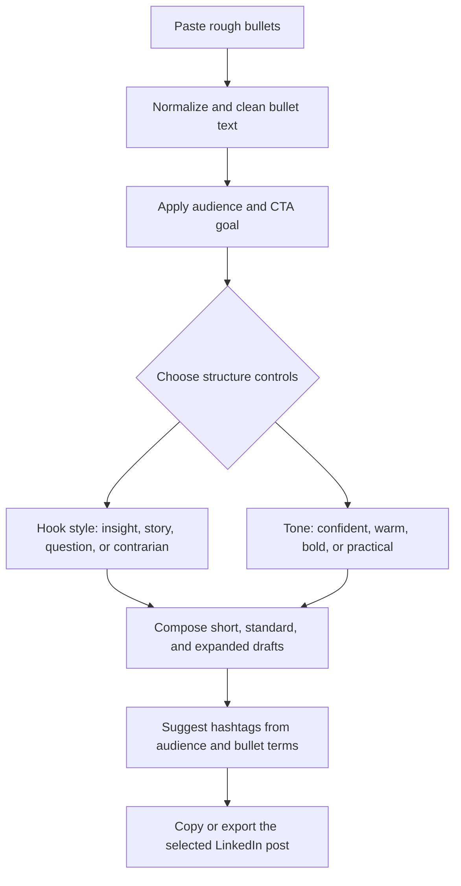

# LinkedIn Bullet Writer

LinkedIn Bullet Writer turns rough notes, launch updates, customer wins, hiring signals, and lessons learned into structured LinkedIn post drafts. It is a local React app: enter bullets, choose the audience and goal, pick a tone and hook style, then copy or export a draft without sending the source text to a backend service.

## Who it is for

- Creators who collect ideas throughout the week and need a fast way to turn them into publishable posts.
- Founders who want clear launch, customer, hiring, fundraising, or product-progress updates without starting from a blank page.
- Recruiters and talent teams who need role updates, candidate-market observations, and hiring-manager insights in a more human format.
- Operators, consultants, and subject-matter experts who want repeatable post structure while keeping the original point of view intact.

## Real-world use cases

- Creator: paste three bullets from a call, choose a warm tone, and turn them into a short story post with a discussion prompt.
- Founder: summarize a product milestone, target the post at buyers or investors, and generate a confident launch update with hashtags.
- Recruiter: enter role requirements and market observations, choose a practical tone, and produce a candidate-facing post that ends with a clear CTA.
- Consultant: convert a client result into a post with an insight hook, scannable body, and reusable export for later review.

## How generation works

The app uses deterministic client-side logic in `src/lib/draftGenerator.ts`; it does not call an AI API. Generation follows this flow:



Tone controls change the closing language and level of directness. Hook controls change the opening pattern. Length tabs reuse the same source bullets but vary density: short is punchier, standard is a balanced LinkedIn post, and expanded adds more explanation for thought-leadership style posts.

## Setup

Requirements:

- Node.js 24 or newer
- npm 11 or newer

Install dependencies:

```bash
npm ci
```

Optional local config:

```bash
cp .env.example .env.local
```

On Windows PowerShell:

```powershell
Copy-Item .env.example .env.local
```

No environment variables are required. If you add Vite variables later, only use the `VITE_` prefix for values that are safe to expose in browser code. Do not put API keys, tokens, credentials, or private drafts in `.env.local`.

## Commands

| Command | Purpose |
| --- | --- |
| `npm run dev` | Start the Vite development server. |
| `npm run lint` | Run ESLint. |
| `npm run typecheck` | Run TypeScript project checks. |
| `npm test` | Run Vitest tests once. |
| `npm run build` | Typecheck and build the production bundle. |
| `npm run preview` | Preview the production build locally. |
| `npm run audit` | Fail on npm vulnerabilities at moderate severity or higher. |
| `npm run outdated` | Check whether direct dependencies are behind the current registry versions. |

## Codebase structure

```text
.
|-- .github/
|   |-- dependabot.yml
|   `-- workflows/ci.yml
|-- public/
|   `-- favicon.svg
|-- src/
|   |-- App.css
|   |-- App.tsx
|   |-- index.css
|   |-- main.tsx
|   `-- lib/
|       |-- draftGenerator.test.ts
|       `-- draftGenerator.ts
|-- .env.example
|-- eslint.config.js
|-- package.json
|-- tsconfig*.json
`-- vite.config.ts
```

## Privacy notes

- Draft generation runs in the browser with local TypeScript functions.
- The app does not include a backend, analytics SDK, database, or third-party writing API.
- Source bullets are held in React state while the page is open.
- Copy and export actions use browser APIs on the selected draft only.
- `.env.local` is ignored by git; `.env.example` documents safe public configuration only.

## Maintenance

CI installs with `npm ci`, checks for outdated direct dependencies, audits at moderate severity or higher, lints, tests, and builds. Dependabot is configured for npm packages and GitHub Actions so dependency maintenance happens through reviewable pull requests.
